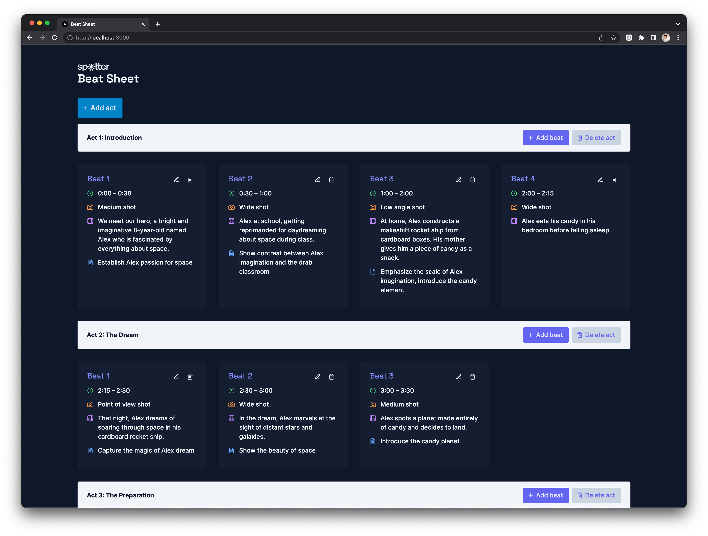

# Beat Sheet

Beat Sheet is a screenwriting app used to plan the content and structure of videos. Acts are large sections of story containing many beats. A beat can be a shot, some lines of dialog, or a whole scene, depending upon the duration of video.



This guide provides instructions on how to run the beatsheet backend in a docker container.

## Requirements

To use this Docker container, you will need to have Docker installed on your system. If you do not have Docker installed, you can download it from [here](https://www.docker.com/products/docker-desktop).

## How to Run Docker Compose

Run the following command to create the Docker container:

```bash
docker compose create
```

Run the following command to start the Docker container:

```bash
docker compose start
```

Alternatively, you can create and start the container by running:

```bash
docker compose up
```

This command will start the Docker container defined in the `docker-compose.yml` file. The BeatSheet API will be accessible at the port defined in the `docker-compose.yml` file.

## Stopping and Removing Containers

To stop the Docker container, you can run:

```bash
docker compose stop
```

This command will stop the running Docker container.

If you also want to remove the Docker container after stopping it, you can run:

```bash
docker compose down
```

This command will stop and remove the Docker container. Please note that any data not stored in a volume will be lost.

## Notes

Please ensure that the port defined in the `docker-compose.yml` file is not being used by any other applications to avoid any port conflict.

## Frontend

The frontend is a Next.js app inside `/beatsheet-app`. The development server can be run with:

```bash
npm run dev
# or
yarn dev
# or
pnpm dev
```

Open [http://localhost:3000](http://localhost:3000) with your browser to see the result.